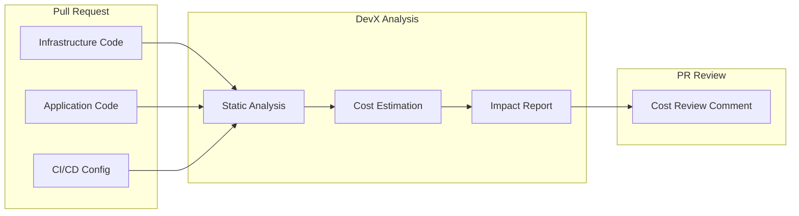

# DevX Cost Regression Detection Demo

> **Prevent cloud cost regressions before they merge** — DevX detects cost risks directly in pull requests across infrastructure, application code, and CI pipelines.

---

## Overview

This repository demonstrates how **DevX** automatically identifies and flags cloud cost risks in your pull requests *before* they reach production.



---

## Detection Examples

### 1. Infrastructure Cost Regression

| Category | Details |
|----------|---------|
| **File** | `infrastructure/main.tf` |
| **Risk** | Always-on NAT Gateway |
| **Impact** | Recurring monthly cost in non-production |

**Change Detected:**

```diff
resource "aws_nat_gateway" "this" {
-  count = 0
+  count = 1
}
```

---

### 2. Application Code Amplification

| Category | Details |
|----------|---------|
| **File** | `application/users.ts` |
| **Risk** | N+1 remote calls |
| **Impact** | Runtime and API cost amplification |

**Change Detected:**

```diff
- for (const user of users) {
-   await fetchProfile(user.id)
- }
+ await Promise.all(users.map(u => fetchProfile(u.id)))
```

---

### 3. CI Inefficiency

| Category | Details |
|----------|---------|
| **File** | `ci/github-actions.yml` |
| **Risk** | Over-provisioned CI runners |
| **Impact** | Increased per-run cost |

**Change Detected:**

```diff
- runs-on: ubuntu-latest
+ runs-on: self-hosted-large
```

---

## How DevX Works

```mermaid
sequenceDiagram
    participant Dev as Developer
    participant GH as GitHub
    participant DX as DevX
    participant PR as Pull Request

    Dev->>GH: Push changes
    GH->>DX: Trigger analysis
    
    rect rgb(40, 40, 60)
        Note over DX: Analysis Phase
        DX->>DX: Scan IaC changes
        DX->>DX: Analyze app code patterns
        DX->>DX: Check CI configurations
        DX->>DX: Estimate cost impact
    end

    DX->>PR: Post cost review comment
    PR->>Dev: View recommendations
```



---

## DevX Output

When a cost regression is detected, DevX posts a **cost review comment** directly in the pull request containing:

| Component | Description |
|-----------|-------------|
| **Estimated Impact** | Monthly cost projection |
| **Severity Level** | Low / Medium / High / Critical |
| **Recommendations** | Clear fix suggestions |

### Screenshot


---

## Project Structure

```
devx-demo-cost-regressions/
├── infrastructure/          # Terraform IaC examples
│   └── main.tf              # NAT Gateway cost demo
├── application/             # Application code examples
│   └── users.ts             # N+1 query pattern demo
├── ci/                      # CI/CD configurations
│   └── github-actions.yml   # Runner over-provisioning demo
└── src/                     # Additional source examples
    ├── cost_bomb_pipeline.py
    └── cost_bomb_worker.ts
```

---

## Getting Started

1. **Clone this repository**
   ```bash
   git clone https://github.com/your-org/devx-demo-cost-regressions.git
   ```

2. **Create a feature branch**
   ```bash
   git checkout -b feature/enable-nat-gateway
   ```

3. **Make a cost-impacting change** (e.g., enable NAT Gateway in `main.tf`)

4. **Open a Pull Request** and watch DevX analyze your changes!

---

## Learn More

For more information about DevX and cloud cost optimization, visit the [DevX Documentation](https://devx.io/docs).
